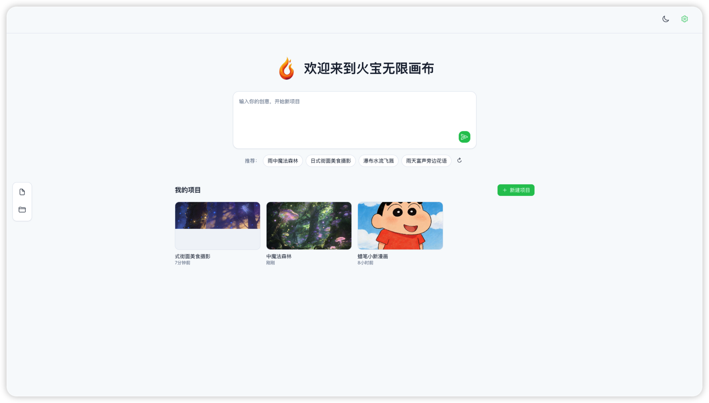
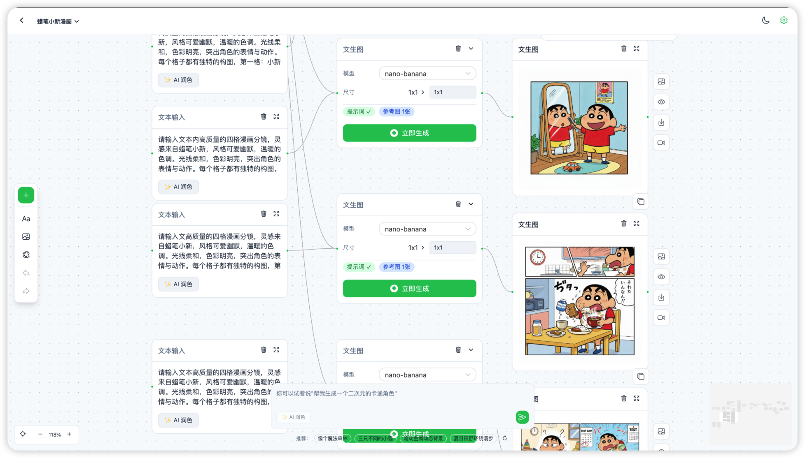
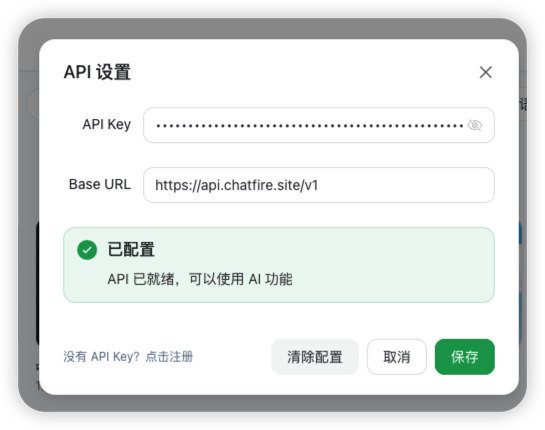

# AI Canvas

一个基于 Vue Flow 的可视化 AI 创作画布，支持文生图、视频生成等 AI 工作流的节点式编排。
[体验地址](https://marketing.chatfire.site/huobao-canvas/)

## 📸 截图

### 首页

### 画布

### API 配置

## ✨ 特性

- 🎨 **可视化节点编排** - 基于 Vue Flow 的无限画布，支持拖拽、缩放、连接
- 🖼️ **文生图工作流** - 支持配置提示词、模型、尺寸等参数生成图片
- 🎬 **视频生成工作流** - 支持图生视频，可设置首帧/尾帧图片
- 🤖 **AI 提示词润色** - 一键 AI 优化提示词，提升生成质量
- 🌓 **深色/浅色主题** - 支持主题切换，保护眼睛
- 💾 **本地项目存储** - 项目数据本地持久化，支持多项目管理
- ↩️ **撤销/重做** - 完整的操作历史记录

## 📦 节点类型

| 节点             | 描述                                   |
| ---------------- | -------------------------------------- |
| **文本节点**     | 输入/编辑提示词文本                    |
| **文生图配置**   | 配置图片生成参数（模型、尺寸、数量等） |
| **图片节点**     | 展示生成的图片或上传本地图片           |
| **视频生成配置** | 配置视频生成参数（支持首帧/尾帧图片）  |
| **视频节点**     | 展示生成的视频                         |

